# PROYECTO CRUD PRODUCTOS FRONTEND ANGULAR
# PROYECTO FINAL MODULO ANGULAR DEL CURSO SUPERIOR DE FRAMEWORKS Y ENTORNOS WEB : ANGULAR, SYMFONY, NODE.JS Y REACT DE INESEM

## Tecnologías:
Angular, scss, mysql, php, html, css, Apache, metodología BEM

## Responsive design: uso de flex 

## Descripción:
### Creación de bbdd en phpmyadmin productos con la tabla stock y los atributos (id, descripcion, precio, img)
### CRUD de productos: crear, borrar, ver, modificar productos.
### Sistema de logueo de usuarios, si el usuario es admin puede ver, borrar, modificar y crear productos; si el usuario no es admin sólo puede ver los productos.

## endpoints
### VIEW: http://localhost/backend/controller/view.php
### DELETE: http://localhost/backend/controller/delete.php?idProduct=2
### CREATE: http://localhost/backend/controller/create.php
### UPDATE: http://localhost/backend/controller/update.php?idProduct=2
### LOGUEO DE USUARIOS:  http://localhost/backend/controller/login.phn
### CIERRE DE SESIÓN DE USUARIOS:  http://localhost/backend/controller/logout.php
### REGISTRO DE USUARIOS:  http://localhost/backend/controller/register.php

## Repositorio frontend Angular, Sass, Typescript, html, css : https://github.com/cferreirobelenguer/crud_frontend
## Repositorio backend php mysql:https://github.com/cferreirobelenguer/crud_backend

## LOGIN
### Vista login, muestra mensajes de error en caso de no introducir los datos correctamente (usuario tiene que tener más de 4 dígitos, contraseña más de 8 dígitos y al menos una mayúscula, una minúscula, número y caracteres especiales ), o en caso de que no se encuentre el usuario y la contraseña.
Cuando el login es correcto, se redirige a home y se crea una sessionStorage con los datos de la sesión de php (datos del usuario)
### Datos mal introducidos, no cumple la validación
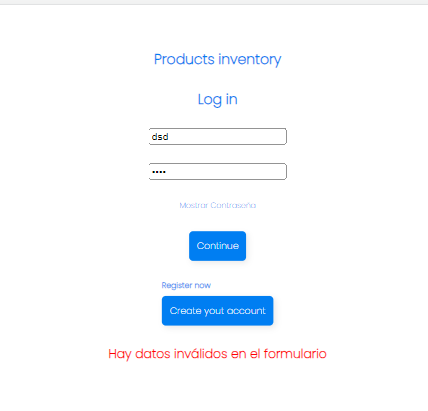
### No se encuentra usuario y contraseña en la bbdd
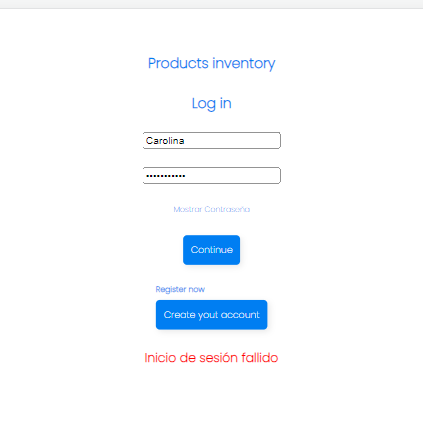

### En caso de que usuario y contraseña se encuentren lleva a la vista de home
### Home está configurado para que sólo se pueda acceder si se está logueado, se ha configurado el archivo auth.guard.ts

## REGISTRO DE USUARIOS
### Si se pulsa create your account se accede a la url register
### Al introducir los datos tienen que cumplir la validación que es la misma que en el logueo ; el email tiene que terminar en @gmail.com o hotmail.com, y la contraseña debe de coincidir con la contraseña repetida; en caso contrario se muestra mensaje de error.
### Cuando se introducen los datos y se pulsa register, la bbdd hace una búsqueda de usuarios con el mismo usuario. En caso de encontrar datos de usuarios con el mismo usuario, se muestra mensaje de error.

### Registro correcto
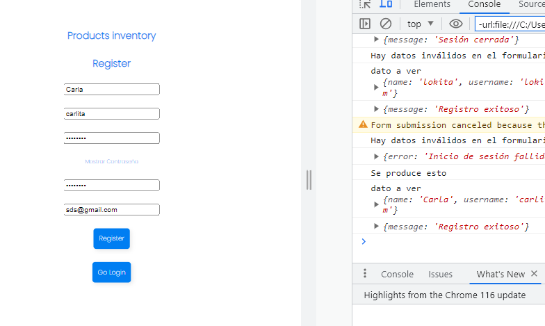
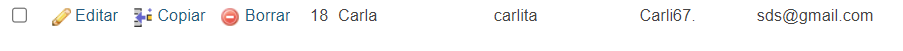
### Error al introducir datos (no se cumple con la validación)
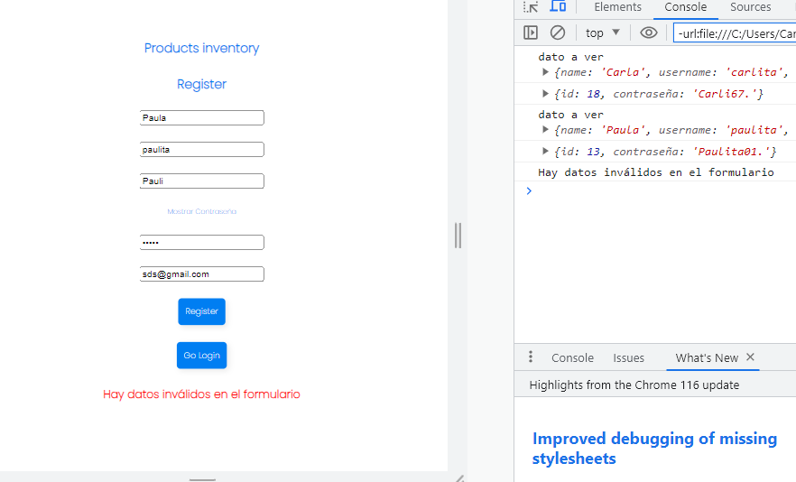
### Se ha encontrado un usuario con el mismo nombre de usuario
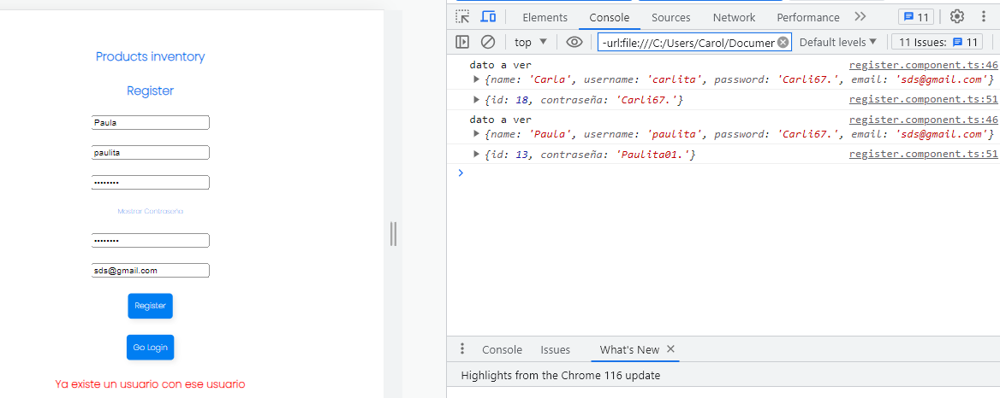

### Tanto en el formulario del logueo como en el registro se puede pulsar mostrar contraseña y se muestra la contraseña que se está escribiendo
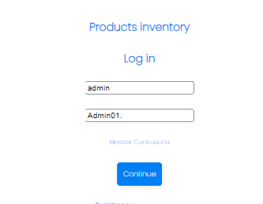

### Home
En home si el usuario es admin tiene habilitadas todas las funciones del crud (crear, ver, modificar y eliminar); el resto de usuarios sólo ven los productos sin poder manipularlos. Al pulsar Logout se cierra la sesión y se elimina la sessionStorage del navegador con los datos del usuario.

### Vista de usuario admin
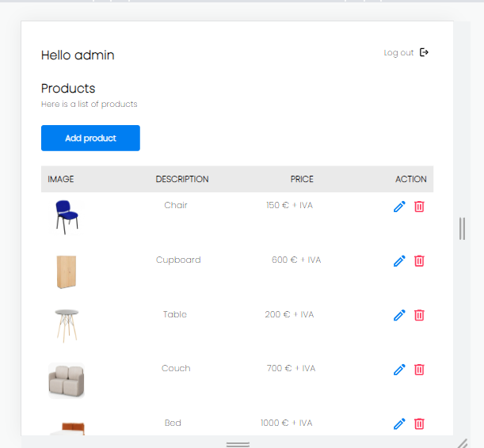
### Vista de resto de usuarios
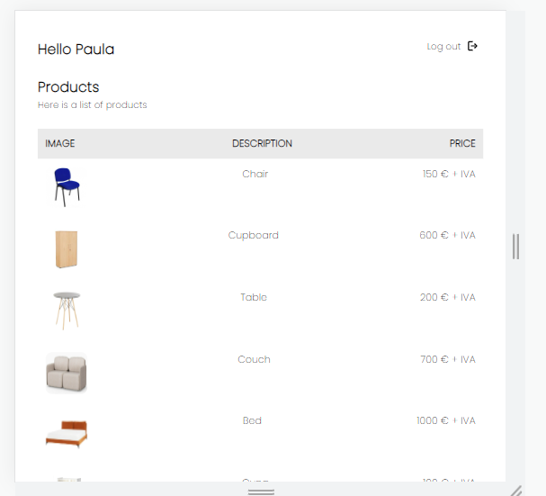

## CRUD

### ELIMINAR: Al pulsar el icono de la papelera se elimina el producto a través del id que se coge por parámetro.
### MODIFICAR: Al pulsar el icono del lápiz redirige a update y coge el id por parámetro. Se introducen los datos que están validados para que se introduza en price números,descripción sean letras tanto mayúsculas como minúsculas de la a a la z y que la url termine en jpg, png o svg. Al pulsar Update product se modifican los datos a través del id del producto mediante una consulta sql. Al puslar home se vuelve a home.
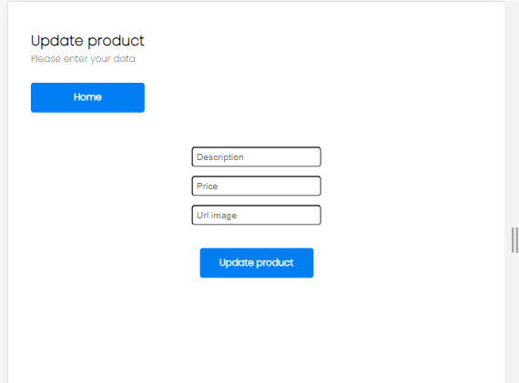
### CREAR NUEVO: Cuando se pulsa Add product se redirige a create , se ha validado que price sea número, descripción sean letras tanto mayúsculas como minúsculas de la a a la z y que la url termine en jpg, png o svg. Al pulsar create product se añade un nuevo producto a la bbdd. Si se pulsa home se vuelve a home.
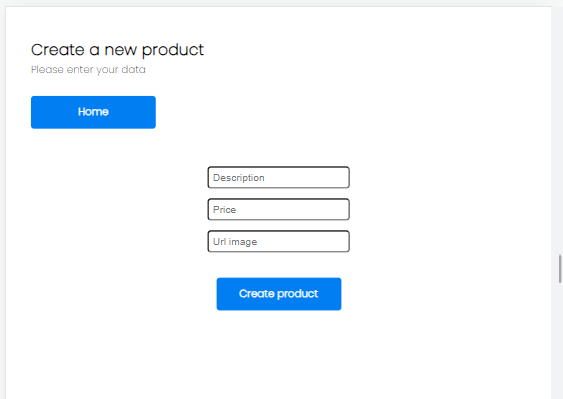

